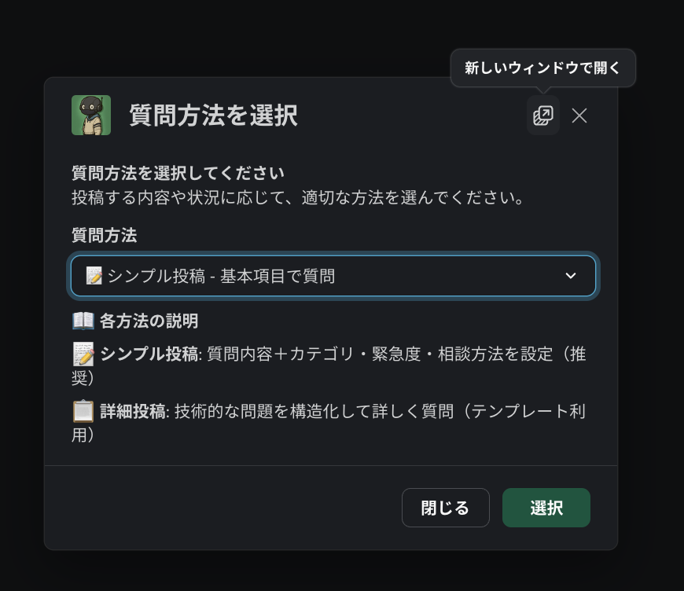
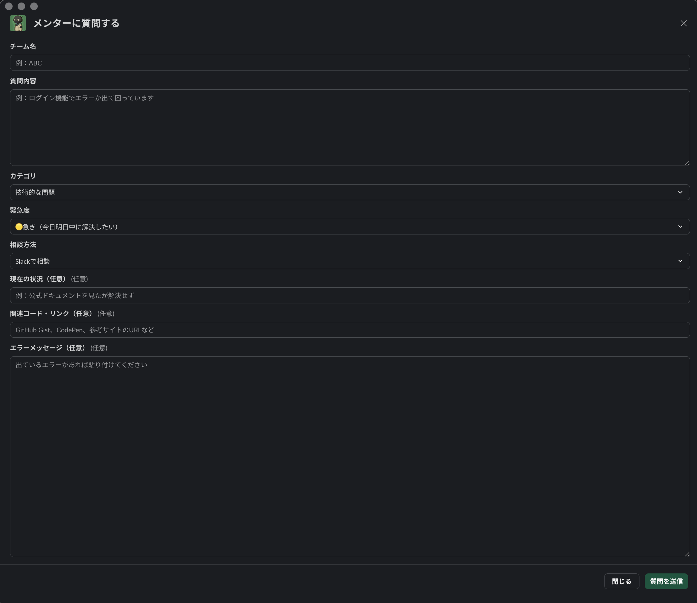

# ユーザーガイド - 質問者向け

## 📝 質問方法

あなたのチームチャンネルで `/mentor-help` を入力して、以下から選択：

- **📝 シンプル質問**（推奨）: サクッと質問
- **📋 詳細質問**: テンプレート使用

## 📂 カテゴリ

質問内容に応じてカテゴリを選択してください：

- **フロントエンド**: React、Vue、HTML/CSS、JavaScript
- **バックエンド**: サーバーサイド、データベース、API、認証
- **インフラ・デプロイ**: Vercel、Netlify、AWS、Docker
- **レイアウト・CSS**: レイアウト、CSS、スタイリング、レスポンシブデザイン
- **UI・UX相談**: ユーザビリティ、デザイン判断、UI改善
- **アイデア相談**: 機能やサービスのアイデア相談・ブラッシュアップ
- **技術選択相談**: どの技術・ツールを使うべきか迷っている
- **なんでも相談**: 技術・企画・デザイン以外の相談
- **エラー・トラブル**: エラーで困っているが原因が分からない

## 📋 フォーム

### 必須項目
- **チーム名**: 例「チームABC」
- **質問内容**: 困っていることを具体的に
- **カテゴリ**: 上記9つから選択
- **緊急度**: 🔴緊急 / 🟡急ぎ / 🟢いつでも
- **相談方法**: Slack / Zoom

### 任意項目
- 試したこと
- 関連リンク（GitHub等）
- エラーメッセージ

### 入力のコツ
**フォームを大きくして入力しやすく**

右上の「📱新しいウィンドウで開く」ボタンをクリック

テキストボックスが広がって長い質問も楽に書けます

## 🔔 投稿後の流れ

1. あなたのチームチャンネルに質問が表示
2. メンターが「対応開始」をクリック
3. チームチャンネル内でスレッド形式での対話開始
4. メンターと一緒に問題解決
5. 「✅ 解決済み」ボタンで完了

## ✅ 解決したら

**「✅ 解決済み」ボタンを押す**
- 質問者（あなた）のみ押せます
- 追加質問は新しく投稿してください

## 💡 質問のコツ

- **何ができないかを最初に書く**（例：「ログインできません」）
- **エラーメッセージをそのままコピー**
- **何を試したかも書く**

---

## ⚡ まとめ

1. チームチャンネルで `/mentor-help` 
2. フォーム入力して送信
3. スレッドでメンターと対話
4. 解決したら「✅ 解決済み」

以上です！🎉